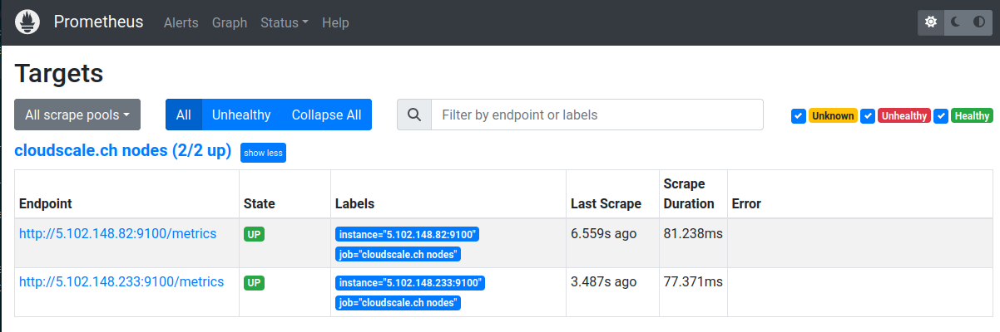

# Cloud Targets Service Discovery

## About

With our Cloud Targets Service Discovery API, you will be able to monitor your dynmaic infrastructure using the [Prometheus Node Exporter](https://github.com/prometheus/node_exporter) installed on your Cloud instances.

Through the API, CTSD returns a Prometheus-compatible targets catalog (HTTP SD) that Prometheus can use to monitor your instances.

The default port Prometheus uses to query your instances is `9100` on the public IP. Using Prometheus' relabeling feature, this port can be changed at will and the scraping address moved to a private network. Appropriate designations are provided for this purpose.

## Requirements

- Prometheus or compatible monitoring solution.
- Node Exporter installed on Cloud instances
- An API token of your Cloud provider (read-only permission would be sufficient)

## Clouds

Prometheus provides [Service Discovery](https://prometheus.io/docs/prometheus/latest/configuration/configuration/#configuration) (SD) for a list of Clouds. Our service adds the following Cloud providers onto the list:

- cloudscale.ch ([Setup](cloudscale_ch.md))
- Exoscale ([Setup](exoscale.md))

## FAQ

### Do you store the Cloud tokens?
No.

### Do you store the result of the Cloud target nodes?
No.

### What is the availabiltiy?
This service is "as is".

### What is the pricing?
This service is free to use.

### Can I test it out?
To tests our API, we provide a [Swagger UI](https://api.ngine.cloud/cloud-sd/)

### Where can I place questions, how can I reach you?
For support, visit [moser-systems.com/contact](https://www.moser-systems.com/contact)
