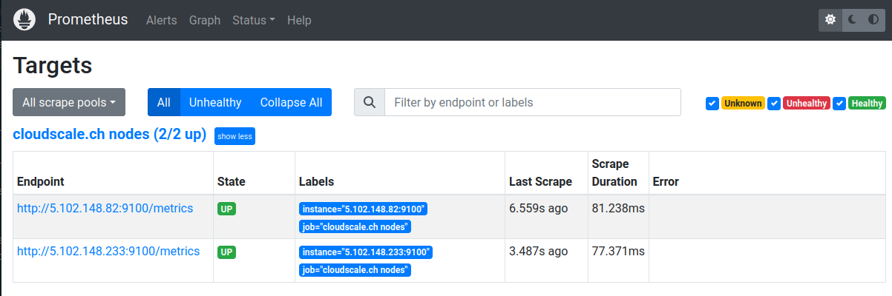

# Cloud Service Discovery

With our Cloud Service Discovery API, you will be able to monitor your infrastructure on Clouds currently not included in Prometheus.

## How it works

The API returns a Prometheus-compatible targets catalog of your Cloud instances that Prometheus can use to monitor them as targets.

Using the [Prometheus Node Exporter](https://github.com/prometheus/node_exporter) installed on Cloud instances, you will be able to monitor your infrastructure fast and efficient. 

The default port to query your instances is `9100` on the public IP. Using Prometheus' relabeling feature, this port can be changed at will and the scraping address moved to a private network. Appropriate designations are provided for this purpose.

## Requirements

- Prometheus or compatible monitoring solution.
- Node Exporter installed on Cloud instances
- An API token of your Cloud provider (read-only permission would be sufficient)

## Clouds

Prometheus provides [Service Discovery](https://prometheus.io/docs/prometheus/latest/configuration/configuration/#configuration) (SD) for a list of Clouds. Our service adds the following Cloud providers onto the list:

- cloudscale.ch ([Setup](cloudscale_ch.md))
- Exoscale ([Setup](exoscale.md))

